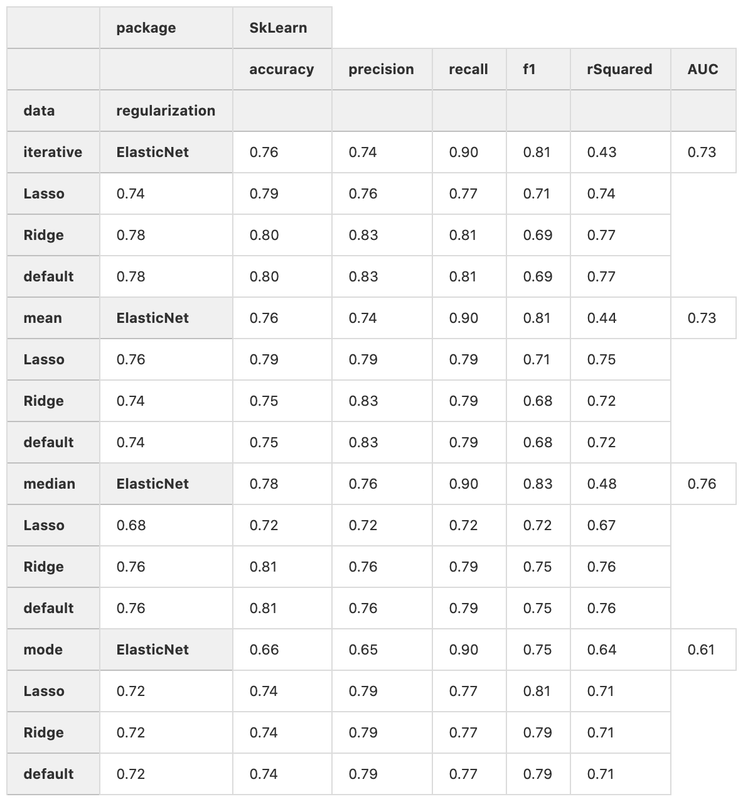
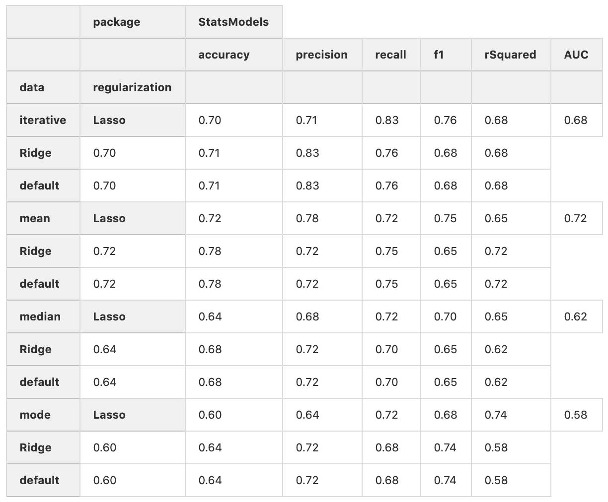

# Reflection
The goal of this assignment was to predict survival on HCC Survival data using Logistic Regression and Survival Analysis.

To achieve this goal, we explored what the data looked like, imputed missing data using SimpleImputer and IterativeImputer from ScikitLearn, and created four new datasets called Mean, Median, Most Frequent, and IterativeImputer. After, logistic regression was used to predict survival using Statsmodels and ScikitLearn. In addition, logistic regression was used in order to measure the impact of Lasso, Ridge, and ElasticNet Regularization. Finally, LifeLines was used to perform the survival analysis on each dataset to see whether the results were different.

The different regularization methods had an impact when using SckitLearn, as we saw the different results. From SkLearn, we chose to proceed with the Lasso regularization from the Mode dataset with a rSquared of 0.81. We thought having negative values were the errors from Sklearn, but from the official documentation([Link](https://scikit-learn.org/stable/modules/generated/sklearn.metrics.r2_score.html)), the rSquared values could be negatives. To check whether we didn’t make any mistakes, we implemented Efron's R squared([Link](https://thestatsgeek.com/2014/02/08/r-squared-in-logistic-regression/)), but we still got similar results. We tried the McFadden's adjusted rSquared method, which gave a better result, similar to the results of StatsModels without any negative values.

However, It seemed like the regularization method did not make any impact when using StatsModels, as the results turned out to be the same. With the results from Statsmodels, we chose the mode dataset with the best performance. Even though the accuracy was low, we primarily looked at the rSquared value when deciding the best performance method.

In the result, ScikitLearn and Statsmodels(uses McFadden's pseudo-R-squared) uses different types of rSquared methods, which also produce different results.




__Lifeline result:__

We picked the columns (‘Hemoglobin’, ‘Albumin’, ‘Iron’) for the analysis.

For all the imputed datasets, ‘Hemoglobin’ and ‘Albumin’ were not significant because the P value was greater than 0.05.

1. Mean Imputed data:
Logistic regression: The increase of ‘Iron’ resulted in increase of ‘class’, basically the 8% increase in the chance of survival. The confidence interval was between 0.2% and 15%. Survival analysis: The increase of 1 in ‘Iron’ increased in the survival of 1%. The confidence interval was between 1% and 2%.

2. Mode and median imputed data:
Similar results to the mean imputed dataset.

3. Iterative imputed data:
We obtained the result despite the column ‘iron’ not being significant.

All python requirements are stored in `requirements.txt`. Run the code below to install the requirements.

```bash
pip install -r requirements.txt
```

# Reflection Questions - Justin
**What do I believe I did well on this assignment?**  
I did well on filling missing data and using all four imputers from SkLearn.

**What was the most challenging part of this assignment?**  
The most challenging part was creating a survival analysis in the end.

**What would have made this assignment a better experience?**  
If I had some knowledge of StatsModels or survival analysis, it would have been better.

**What do I need help with?**  
I would need help in plotting the regression line and other plots using lifelines.


# Reflection Questions - Daniel
**What do I believe I did well on this assignment?**  
I did well on saving results (`accuracy`, `precision`, `recall`, `f1`, `rSquared`, and `AUC`) from each model run. This is presented in a nicely formatted table at the end of `Logistic_Regression` notebook.  

**What was the most challenging part of this assignment?**  
Previously, the `r2_score` posed a challenge. Some $ R^2 $'s were negative or very low for some models generated by `SkLearn`. Upon further research, we decided to use a custom implementation of McFadden's Adjusted $ R^2 $.

**What would have made this assignment a better experience?**  
`Statsmodel` being able to have Lasso, Ridge, and ElasticNet Regularization working properly.

**What do I need help with?**   
Deeper dive into making predictions with Survival Regression.


# Reflection Questions - Ryan
**What do I believe I did well on this assignment?**  
I did well on the organizing and cleaning the data.

**What was the most challenging part of this assignment?**  
Pretty much everything about this assignment was challenging for me. As we went through and discussed how logistic regression and survival analysis should be done, I got a much better understanding of the subject. However, I still have a long way to go.

**What would have made this assignment a better experience?**  
If I had better background knowledge on this methods, it would've been a better experience. I had 

**What do I need help with?**  
I need to have more basic understand of statistics to interpret the results.

## License

The license to be used is [MIT](https://choosealicense.com/licenses/mit/)